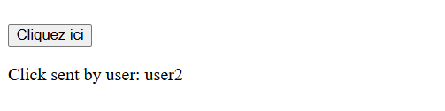
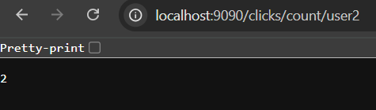

# 🖱️ Real-time Click Counter with Kafka Streams

A Spring Boot application that demonstrates real-time click event processing using Apache Kafka Streams. This application tracks user clicks, processes them in real-time, and provides REST APIs to query click statistics.

## 🎯 Features

- **Real-time Processing**: Processes click events as they occur
- **User-specific Tracking**: Tracks clicks per user ID
- **RESTful API**: Provides endpoints to query click statistics
- **Scalable Architecture**: Built on Kafka Streams for distributed processing
- **Interactive Web Interface**: Simple web UI to simulate user clicks

## 🏗️ Architecture

```
┌─────────────┐     ┌───────────┐     ┌─────────────────┐     ┌───────────────┐
│  Web UI     │────▶│  REST API │────▶│  Kafka (clicks) │────▶│  Kafka       │
│  (Port 9090)│     │  (Spring) │     │                 │     │  Streams     │
└─────────────┘     └───────────┘     └─────────────────┘     └───────┬───────┘
                                                                      │
                                                                      ▼
┌───────────────────┐     ┌─────────────────────────────┐     ┌───────────────┐
│  Click Count API  │◀────│  Kafka (click-counts)      │◀────│  Aggregation  │
│  (REST Endpoints) │     │                             │     │  Processor    │
└───────────────────┘     └─────────────────────────────┘     └───────────────┘
```

## 🚀 Getting Started

### Prerequisites

- Java 17 or higher
- Apache Kafka 3.0+
- Maven 3.6.3+
- Docker (optional, for running Kafka)

### Running with Docker Compose

The easiest way to run the application is using the provided `docker-compose.yml` in the parent directory:

```bash
# From the TP_KafkaStream directory
docker-compose up -d
```

This will start:
- Zookeeper
- Kafka Broker
- Kafka UI (accessible at http://localhost:8080)

### Manual Setup

1. **Start Kafka**
   ```bash
   # Start Zookeeper
   bin/zookeeper-server-start.sh config/zookeeper.properties
   
   # Start Kafka
   bin/kafka-server-start.sh config/server.properties
   ```

2. **Create Kafka Topics**
   ```bash
   # Create topics
   kafka-topics --create --topic clicks --partitions 1 --replication-factor 1 --bootstrap-server localhost:9092
   kafka-topics --create --topic click-counts --partitions 1 --replication-factor 1 --bootstrap-server localhost:9092
   ```

3. **Build and Run the Application**
   ```bash
   mvn clean package
   java -jar target/click-counter-app-1.0-SNAPSHOT.jar
   ```

## 🌐 Web Interface

Access the web interface at: http://localhost:9090



## 🔌 API Endpoints

### 1. Simulate Click
Simulates a click event from a random user (user1, user2, or user3).

- **URL**: `POST /click`
- **Response**:
  ```json
  {
    "message": "Click sent by user: user1"
  }
  ```

### 2. Get All Click Counts
Retrieves click counts for all users.

- **URL**: `GET /clicks/count/all`
- **Response**:
  ```json
  {
    "user1": 5,
    "user2": 3,
    "user3": 7
  }
  ```

### 3. Get Click Count by User
Retrieves click count for a specific user.

- **URL**: `GET /clicks/count/{userId}`
- **Parameters**:
  - `userId`: The ID of the user (e.g., user1, user2, user3)
- **Response**:
  ```json
  5
  ```

## 🛠️ Technology Stack

- **Spring Boot 3.0+**: Application framework
- **Kafka Streams**: Real-time stream processing
- **Apache Kafka 3.0+**: Message broker
- **Maven**: Build and dependency management
- **Thymeleaf**: Server-side Java template engine for web interface

## 📊 Monitoring

You can monitor the Kafka topics using the Kafka UI at http://localhost:8080 or using the Kafka CLI:

```bash
# View click events
kafka-console-consumer --bootstrap-server localhost:9092 --topic clicks --from-beginning

# View click counts
kafka-console-consumer --bootstrap-server localhost:9092 --topic click-counts --from-beginning --property print.key=true --property value.deserializer=org.apache.kafka.common.serialization.LongDeserializer
```

## 🤝 Contributing

Contributions are welcome! Please feel free to submit a Pull Request.

## 📜 License

This project is licensed under the MIT License - see the [LICENSE](../../LICENSE) file for details.

---
👩‍💻 **Author**: Aisha Saasaa  
📅 **Last Updated**: August 2024.

## Run

Make sure Kafka is running (`docker-compose up`) then:

```bash
cd click-counter-app
mvn spring-boot:run
```

## Example Output

```
User: user1 -> Clicks: 3
User: user2 -> Clicks: 5
```

## Interface & Workflow Overview

This application simulates user clicks, processes them using Kafka Streams, and exposes real-time analytics via a REST API.

🔘 Simple HTML interface with a button to trigger a Kafka event (click by a random user).


📥 Raw Kafka consumer output for the clicks topic showing individual user clicks.


📊 Kafka consumer for click-counts topic, showing aggregated click counts per user.


🔍 REST API: Get clicks for a specific user via GET /clicks/count/{userId}.



🧾 REST API: View all users' click counts via GET /clicks/count/all.


